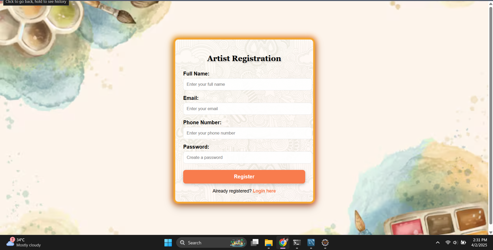
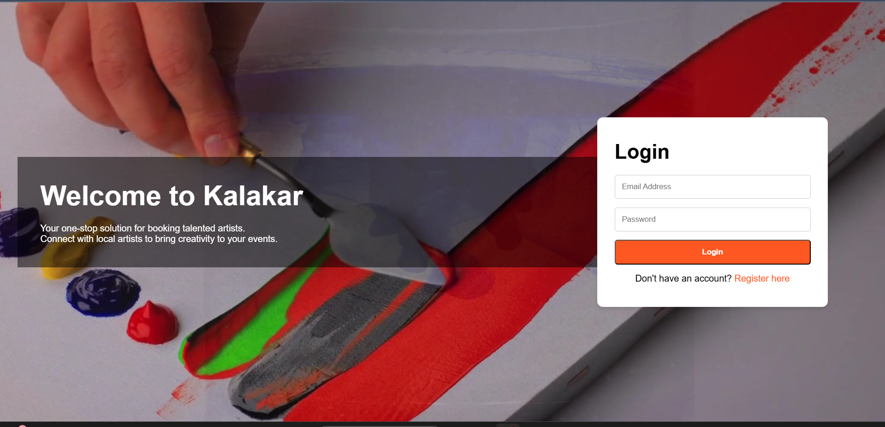
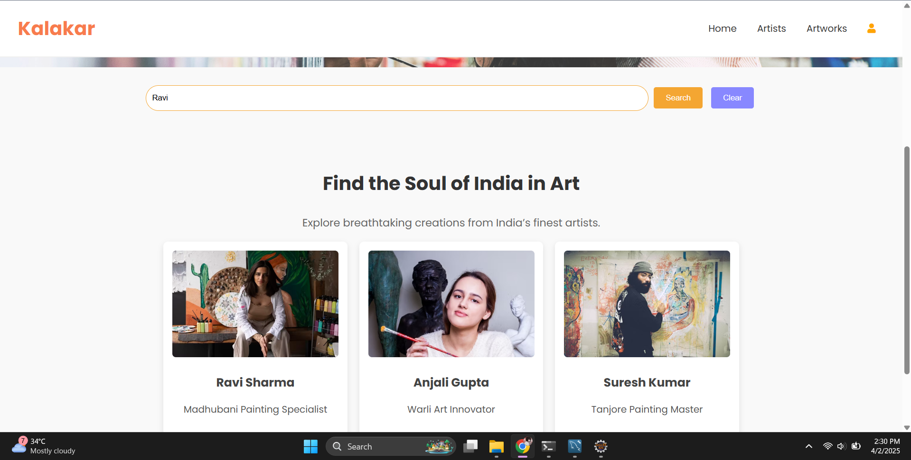
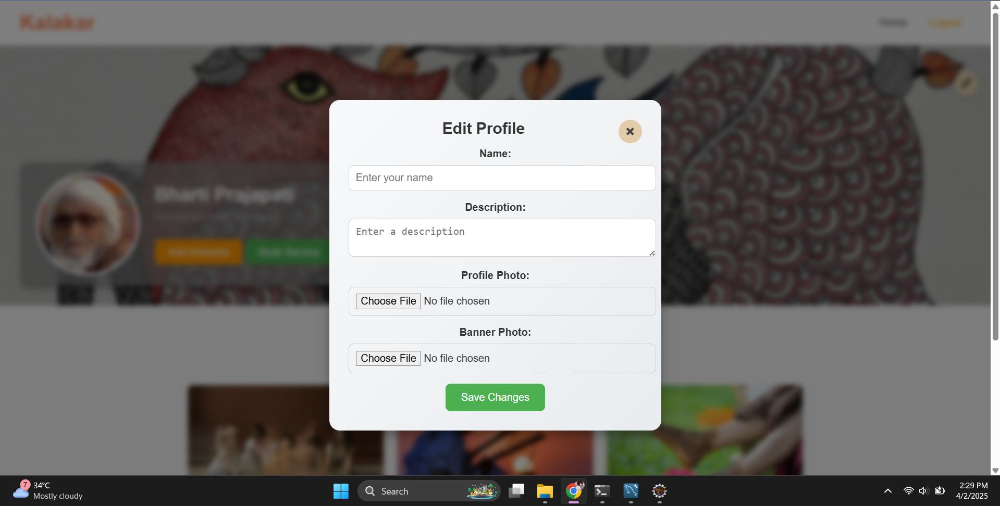
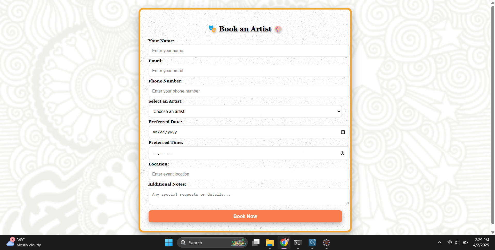
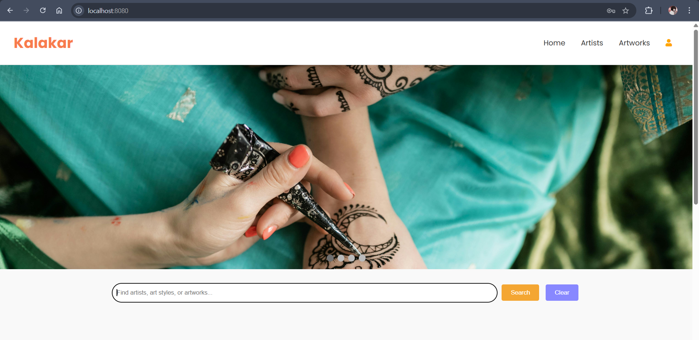
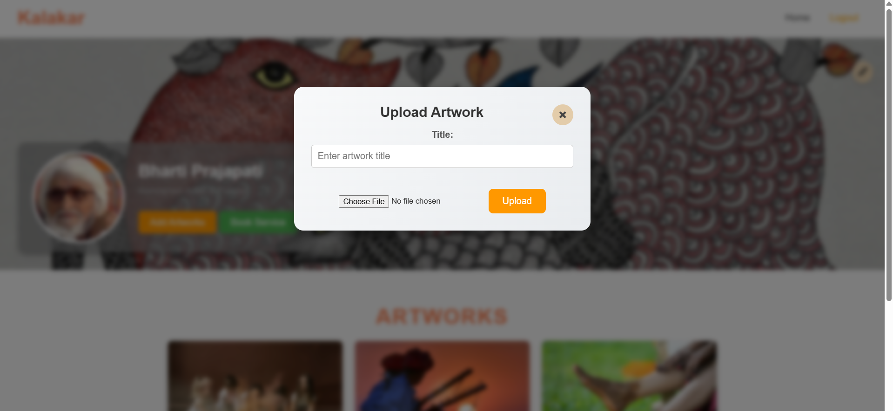

####  Project Title: Kalakar

## The Local Artist Connect System is a Full Stack Java-based platform designed to bridge the gap between local artists and individuals or organizations looking for artistic talent. The system allows artists to register and showcase their expertise, making it easier for event organizers, businesses, and art enthusiasts to find and connect with them based on specific fields of interest.

## Website images

## Objectives:

•	To create a centralized platform for artists to register and manage their profiles.
•	To facilitate easy search and discovery of artists based on their field of expertise.
•	To provide a user-friendly interface for both artists and users looking for artists.
•	To enhance local artist visibility and encourage collaboration in the creative industry.

## Features:

1.	Artist Registration:
o	Artists can sign up and provide details such as name, date of birth (DOB), field of expertise, contact information, portfolio links, and images/videos of their work.

3.	Search Functionality:
o	Users can search for artists based on field of expertise (e.g., painters, musicians, dancers, sculptors).
o	Advanced filters can be implemented for location-based search, ratings, and availability.

4.	Profile Management:
o	Artists can update their profiles, add new artworks, and modify personal details.
o	Users can view detailed artist profiles before making a selection.

5.	Contact & Booking Feature (Optional Enhancement):
o	Users can directly contact artists through the system.
o	A simple booking system can be added to schedule performances, workshops, or collaborations.

6.	Admin Dashboard:
o	Admins can approve artist profiles, manage reported content, and monitor system activity.

## Technology Stack:
•	Frontend: HTML, CSS, JavaScript,  (or JSP for Java-based frontend)
•	Backend: Java (Spring Boot)
•	Database: MySQL 

## Future Scope & Enhancements:
•	AI-based recommendations for users based on previous searches.
•	Integration with social media for artists to link their portfolios.
•	Rating & Reviews System for users to provide feedback on artists.
•	Event Management Module to allow artists to list upcoming performances.
